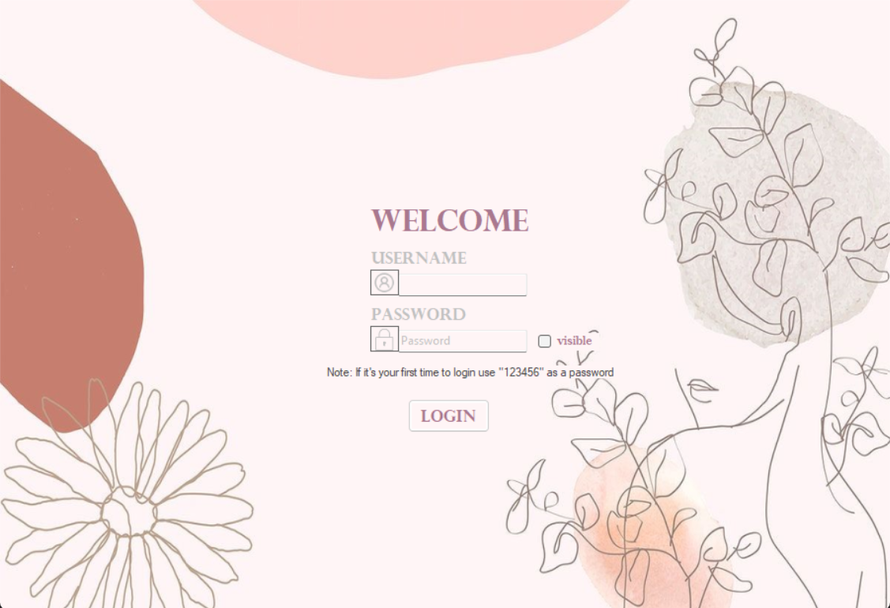
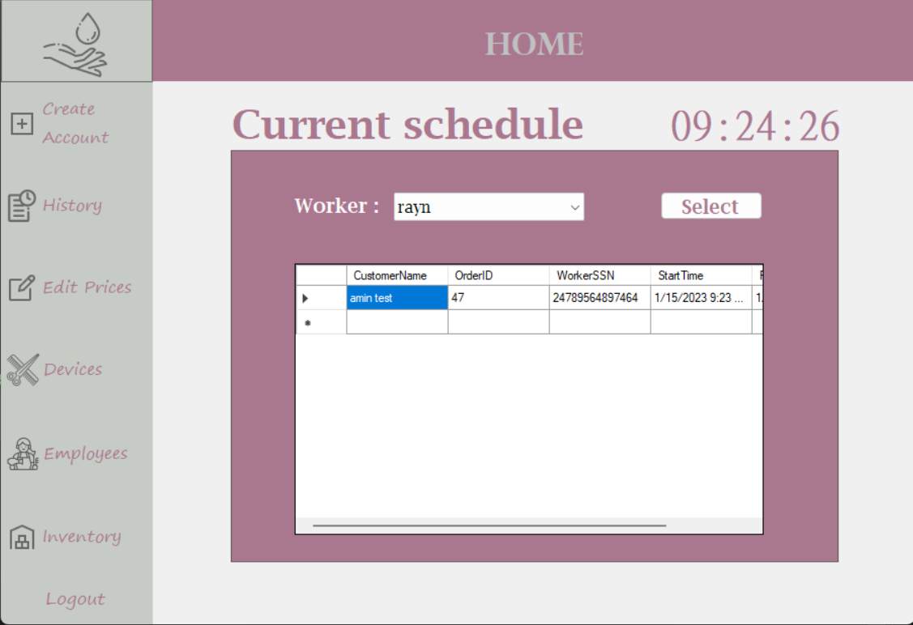
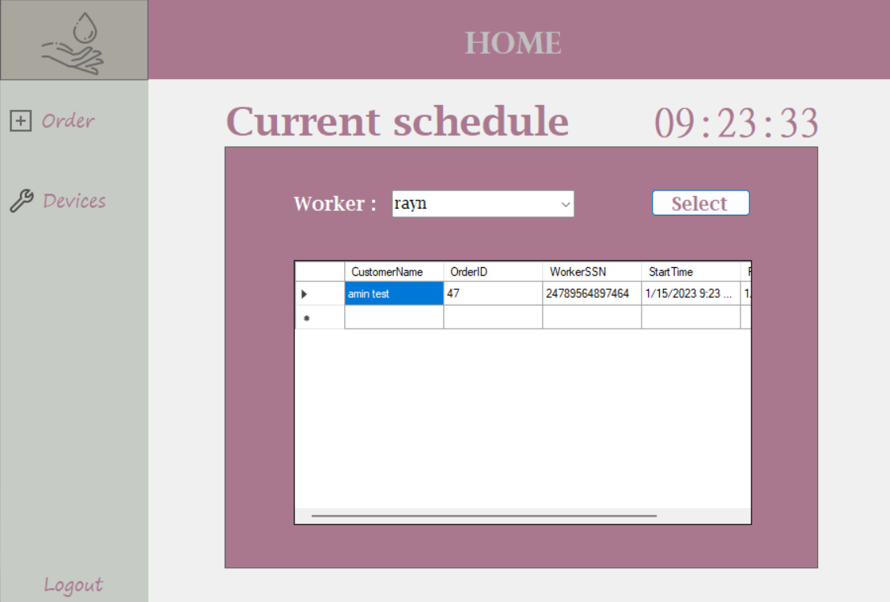
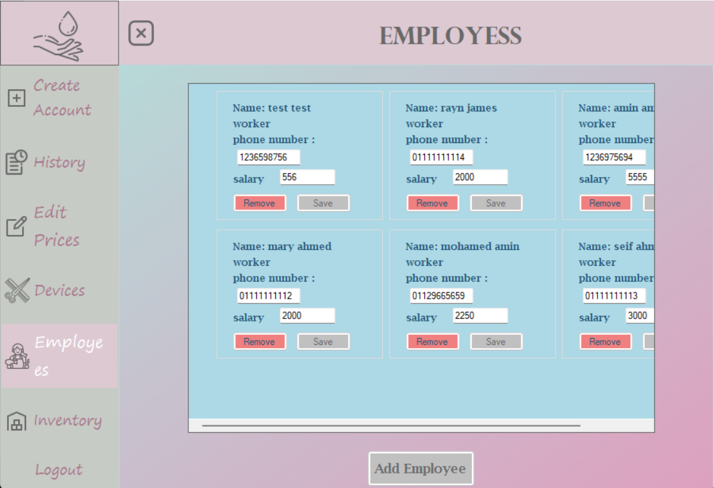

## DB-F22-Team-18
This is Database course project Fall 2022, we will be using an SQL server language along with C# to implement a desktop application

As the world is moving towards digitalization. We looked at a system that could be digitalized, and we choose a management system for a beauty salon.  

We’re planning to implement a Desktop Application to be used as a management system for a small beauty salon. We are going to resample a real beauty salon system where simply we have customers, Teller, and  administrator. The teller and admin will use the application to facilitate their work to store data of the salon orders, inventory, employees, and customers through a well designed simple UI. 

In this system there will be two users, first the Admin who represent the salon owner. Teller who represent the one working on the front desk to place orders and answer the customers questions and offer them discounts. A list of the users privileges could be found in the next section.

#Implementation
The application start with Login page shown below

Based on the credentials it gets directed either to Admin view, or Teller view. Where each has his functionalities.

Admin View:

Teller View:

One of the Admin functionalities is to view all employees, and edit there Salary And/Or their Phone Number.

Please feel free to test the application to see the rest of the functionalities.

For any further clarification/Reccommendations feel free to reach out.
